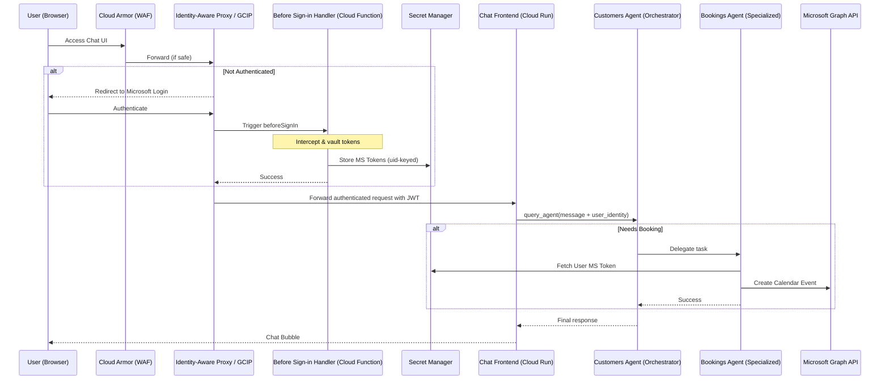

# Agent Security Patterns: Multi-Agent Customer Booking Assistant

A reference implementation for a secure, multi-agent system on Google Cloud. This project demonstrates how to orchestrate specialized agents while maintaining a hardened security perimeter using **Identity-Aware Proxy (IAP)**, **Identity Platform (GCIP)**, **Cloud Armor (WAF)**, and a **"Before Sign-in" blocking function** for secure Microsoft token vaulting.

## 🛡️ Security Architecture

This repository implements the following **Agent Security Patterns**:

- **Perimeter Security:** Cloud Armor protects against WAF threats (SQLi, XSS), while IAP ensures only authenticated users can reach the frontend.
- **Identity Orchestration:** Google Cloud Identity Platform (GCIP) manages multi-tenant authentication, specifically configured here for Microsoft Entra ID.
- **Token Vaulting:** A "Before Sign-in" blocking function intercepts Microsoft OAuth tokens (Access & Refresh) during login and securely vaults them in **Secret Manager**, allowing the agents to act on behalf of the user (e.g., managing Outlook Calendars).
- **Multi-Agent Delegation:** A "Customers" orchestrator agent manages user identity and delegates specialized tasks to a "Bookings" agent via the Vertex AI Agent Engine REST API.

### Architecture Diagram



## 🚀 Setup Instructions

### 1. Prerequisites
- **Argolis Account** (for DNS and internal testing).
- **Google Cloud SDK (gcloud)**.
- **uv** Python package manager.
- **Microsoft Azure/Entra Account** (with permission to register apps).

### 2. Initial Project Setup
1. Create a new Google Cloud project (recommended).
2. Clone the repository.
3. Copy `config.example.sh` to `config.sh`.
4. Run the initial setup scripts:
   ```bash
   cd setup-scripts
   ./enable-apis.sh
   ./grant-all.sh
   ./setup-ar-repo.sh
   ./grant-cloud-build-roles.sh
   cd ..
   ```

### 3. Frontend Deployment
1. Build the frontend image:
   ```bash
   cd fast-api-fe
   ./build-on-cloud-build.sh
   ```
2. Deploy the frontend service:
   ```bash
   ./deploy.sh
   cd ..
   ```

### 4. Argolis DNS Setup
1. Follow **go/argolis-dns** to create a DNS zone.
2. Generate an external IP:
   ```bash
   cd ingress/setup-scripts
   ./setup-external-ip-addr.sh
   ```
3. Create a **DNS A record** (e.g., `bookings.[DNS_ZONE]`) pointing to the generated IP.

### 5. Microsoft App Registration
1. Sign in to [Microsoft Entra](https://entra.microsoft.com/).
2. Click **App Registrations** in the left menu > **New Registration**.
3. Name: `agentic-booking-application`.
4. Supported account types: **Any Entra ID Tenant + Personal Microsoft Accounts**.
5. Click **Register**. Copy your **Application (Client) ID**.
6. Navigate to **Certificates & secrets** > **New client secret**. Copy the **Value** (not Secret ID).
7. Navigate to **Authentication** > **Add a platform** > **Web**:
   - Redirect URI: `https://{PROJECT_ID}.firebaseapp.com/__/auth/handler`
   - Check **ID tokens** and **Access tokens**.
8. Navigate to **API permissions** > **Add a permission** > **Microsoft Graph**:
   - **Application permissions**: Add `Calendars.ReadWrite`.
   - **Delegated permissions**: Add `email`, `offline_access`, `profile`, `openid`.

### 6. Identity Platform (GCIP) Configuration
1. Navigate to **Identity Platform** in the Cloud Console.
2. **Enable Tenants:** Go to **Settings** (gear icon) > **Security** tab > Click **Allow Tenants**.
3. **Add Tenant:** Click **Add a Tenant**, name it `ms-agent-tenant`.
4. **Configure Provider:**
   - Select `ms-agent-tenant` from the **Scope to a Tenant** selector.
   - Click the **Providers** icon (shapes) > **Add a Provider**.
   - Select **Microsoft** and fill in your Client ID and Secret from Entra.
   - *Note: Ignore the recommended Callback URL in this form.*
5. **Configure Domain & Triggers:**
   - Switch **Scope to a Tenant** back to **None (Project)**.
   - **Security Tab:** Add your custom domain (e.g., `bookings.[LDAP].demo.altostrat.com`).
   - **Triggers Tab:** Scroll to **Additional Provider Token Credentials** and check **ID, Access, and Refresh**. Click **Save**.
6. Update `gcip-config.sh` with your `DOMAIN`, `API_KEY`, and `TENANT_ID`.

### 7. Ingress & IAP Configuration
1. Run the ingress setup:
   ```bash
   cd ingress/setup-scripts
   ./setup-all.sh
   cd ../..
   ```
2. **Branding:** Navigate to the **Branding** page (Google Auth Platform). Set name to `iap-client`, support email and contact info to `admin@{LDAP}.altostrat.com`, and set audience to **External**.
3. **Create IAP OAuth Credentials:**
   - Go to **APIs & Services > Credentials** > **Create Credentials > OAuth client ID**.
   - Type: **Web application**. Name: `IAP-frontend-ui-backend`.
   - Click **Create**. Download the JSON or copy the **Client ID** and **Client Secret**.
   - Click the **Pencil icon** (Edit) for this client and add an **Authorized redirect URI**: 
     `https://iap.googleapis.com/v1/oauth/clientIds/{YOUR_FULL_CLIENT_ID}:handleRedirect`
4. **Enable IAP on Backend:**
   - Navigate to the **IAP** page in the Cloud Console.
   - Click the toggle next to `frontend-ui-backend` (under Backend Services).
   - Click **Turn On** (confirming you've read the docs).
   - Click **Actions > Settings** for that backend.
   - Select the **Custom OAuth** radio button. Enter the Client ID and Secret you created.
   - Click **Save**.
5. **Update Config:** Click **Actions > Get JWT Audience Code**. Copy this value into `config.sh` as `IAP_EXPECTED_AUDIENCE`.

#### 🔍 Intermediate Validation: IAP Endpoint
1. Visit your custom domain (e.g., `bookings.[LDAP].demo.altostrat.com`).
2. **Troubleshooting `Forbidden` Error:**
   - If you see `Error: Forbidden - Your client does not have permission to get URL /auth/handler.html...`:
   - Copy the `REDIRECT_URI` shown in the error.
   - Add it as an **Authorized redirect URI** in your OAuth Client (on the **Credentials** page).
   - Navigate to the **Cloud Run** service for the frontend, click the **Security** tab, and ensure **Allow Public Access** is selected.
3. **Success Criterion:** You should see the chat interface. If you type a message and see *"Error: Server misconfiguration: Missing IAP audience string"*, your IAP config is working correctly.

### 8. Blocking Function (Token Vault)
1. Deploy the "Before Sign-in" handler:
   ```bash
   cd ingress/before-sign-in-handler
   ./deploy.sh
   ./attach-function-to-iap.sh
   cd ../..
   ```

#### 🔍 Intermediate Validation: Token Vaulting
1. **Trigger Re-authentication:** Use your browser to visit your application. If you are already signed in, you must delete the session cookies for your domain to trigger the blocking function:
   - Open browser **Developer Tools** (F12) > **Application** tab > **Cookies** (in the left menu).
   - Select your domain and click **Clear All** (circle with a line through it).
   - *Note: You do not need to sign out of your Microsoft account itself.*
2. **Sign In:** Authenticate again via Microsoft.
3. **Verify Vaulting:** Visit **Secret Manager** in the Google Cloud Console.
4. **Success Criterion:** You should see a new secret prepended with `ms-tokens-` (e.g., `ms-tokens-[USER_UID]`). This confirms the blocking function is correctly intercepting and vaulting the Access and Refresh tokens.

### 9. Agent Engine Deployment
1. Deploy **Bookings Agent**:
   ```bash
   source config.sh
   uv run python bookings/deploy_agent_engine.py
   ```
   Update `BOOKINGS_ENGINE_ID` and `BOOKINGS_PRINCIPAL` in `config.sh`.
2. Deploy **Customers Agent**:
   ```bash
   source config.sh
   uv run python customers/deploy_agent_engine.py
   ```
   Update `CUSTOMERS_ENGINE_ID` and `CUSTOMERS_PRINCIPAL` in `config.sh`.
3. Run final permission grants:
   ```bash
   cd setup-scripts
   ./after-agents-deployment-grant.sh
   ./after-customers-agent-deployment-grant.sh
   cd ..
   ```

### 10. Final Redeploy
Redeploy the frontend to pick up all final environment variables:
```bash
cd fast-api-fe
./deploy.sh
```

## 🧪 Final Validation
1. Visit your custom domain.
2. Prompt the agent: *"Make an appointment for a 45 minute haircut for Bob on April 24, 2026"*.
3. **Success Criterion:** Verify a "Success" message in chat and check your [Outlook Calendar](https://outlook.live.com/calendar/) for the new event.

## 💻 Local Development

While the full security pattern requires a deployed environment, you can test agent logic locally:

### 1. Run Agents Locally
Use the ADK web interface to interact with your agents individually:
```bash
# Run Bookings Agent
uv run adk web --port 8001

# Run Customers Agent
uv run adk web --port 8002
```

### 2. Run Frontend Locally
You can run the FastAPI frontend on your local machine. It will proxy requests to your deployed `customers` agent:
```bash
export PROJECT_ID=[YOUR_PROJECT_ID]
export LOCATION=us-central1
export CUSTOMERS_ENGINE_ID=[YOUR_DEPLOYED_ID]
export IAP_EXPECTED_AUDIENCE=[YOUR_AUDIENCE]

uv run uvicorn fast-api-fe.main:app --reload --port 8080
```
*Note: Local frontend execution bypasses IAP; ensure your local environment has `roles/aiplatform.user` permissions.*

### 3. Evaluation
Run automated evalsets to verify agent performance:
```bash
uv run adk eval --config tests/eval/eval_config.json
```

---
*Reference Guide: @will_end_user_agent_guide.md*
