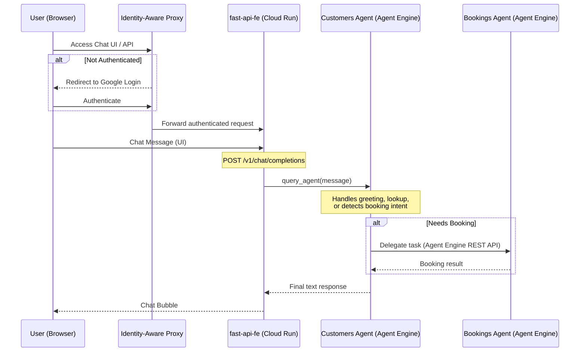
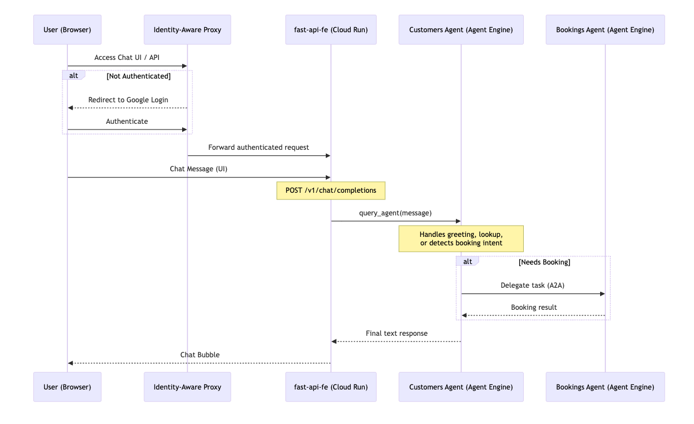

# customer-booking-agent

ReAct agent using Vertex AI Agent Engine REST API — customers agent calls bookings agent via Agent Engine REST API
generated with [`googleCloudPlatform/agent-starter-pack`](https://github.com/GoogleCloudPlatform/agent-starter-pack) version `0.39.3`

## Architecture



<!--  -->

## Project Structure

```text
customer-booking-agent/
├── bookings/               # Bookings Agent (ADK/A2A app)
│   ├── agent.py            # Agent definition & ADK/A2A/FastAPI app
│   ├── agent_executor.py   # A2A adapter (Reasoning Engine wrapper)
│   └── deploy_agent_engine.py # deploy bookings agent to agent engine
├── customers/              # Customer Agent (Orchestrator)
│   ├── agent.py            # Main orchestrator logic
│   ├── app.py              # AdkApp wrapper
│   └── deploy_agent_engine.py # deploy customers agent to agent engine
├── fast-api-fe/            # Web Chat Interface (FastAPI)
│   ├── main.py             # App entry point
│   ├── routers/            # OpenAI-compatible API routes
│   └── services/           # Client for Agent Engine
├── deployment/             # Infrastructure & Deploy Utils
│   ├── agent_engine/       # Shared deployment scripts
│   └── terraform/          # GCP resource provisioning
├── architecture-diagrams/  # Architecture diagrams and assets
├── plans/                  # Implementation plans and documentation
├── tests/                  # Unit and integration tests
├── Makefile                # Project-wide development commands
└── pyproject.toml          # Root dependencies
```

> 💡 **Tip:** Use [Gemini CLI](https://github.com/google-gemini/gemini-cli) for AI-assisted development - project context is pre-configured in `GEMINI.md`.

## Requirements

Before you begin, ensure you have:

- **uv**: Python package manager (used for all dependency management in this project) - [Install](https://docs.astral.sh/uv/getting-started/installation/) ([add packages](https://docs.astral.sh/uv/concepts/dependencies/) with `uv add <package>`)
- **Google Cloud SDK**: For GCP services - [Install](https://cloud.google.com/sdk/docs/install)
- **Terraform**: For infrastructure deployment - [Install](https://developer.hashicorp.com/terraform/downloads)
- **make**: Build automation tool - [Install](https://www.gnu.org/software/make/) (pre-installed on most Unix-based systems)

## Development

Edit your agent logic in `app/agent.py` and test with `make playground` - it auto-reloads on save.
Use notebooks in `notebooks/` for prototyping and Vertex AI Evaluation.
See the [development guide](https://googlecloudplatform.github.io/agent-starter-pack/guide/development-guide) for the full workflow.

## Observability

Built-in telemetry exports to Cloud Trace, BigQuery, and Cloud Logging.
See the [observability guide](https://googlecloudplatform.github.io/agent-starter-pack/guide/observability) for queries and dashboards.

## A2A Inspector

This agent supports the [A2A Protocol](https://a2a-protocol.org/). Use `make inspector` to test interoperability.
See the [A2A Inspector docs](https://github.com/a2aproject/a2a-inspector) for details.

## JWT Claims & User Context

The application extracts all claims from the Identity-Aware Proxy (IAP) JWT token and forwards them to the agents. This provides:

- **User Identity**: Stable unique IDs (`sub`) and emails.
- **Access Levels**: Google Cloud Access Context Manager levels.
- **Custom Attributes**: Roles, tiers, and departments (via GCIP/Firebase).

Detailed information on how these claims are passed and handled can be found in [plans/jwt_claims.md](plans/jwt_claims.md).

## Add Permission to Agent Engine Default SA

```bash
gcloud projects add-iam-policy-binding genai-apps-25 --member="serviceAccount:service-803095609412@gcp-sa-aiplatform-re.iam.gserviceaccount.com" --role="roles/aiplatform.user"
```

## How to Run Local and Deploy To Agent Engine:

1. deploy bookings agent to agent engine

```bash
uv run python bookings/deploy_agent_engine.py
```

2. start customers agent (ensure `BOOKINGS_ENGINE_ID` is set to your deployed customer agent)

```bash
uv run adk web --port 8001
```

3. deploy customers agent to agent engine (ensure `BOOKINGS_ENGINE_ID` is set to your deployed customer agent)

```bash
uv run python customers/deploy_agent_engine.py
```

4. Launch the web interface (ensure `CUSTOMERS_ENGINE_ID` is set to your deployed customer agent):

```bash
uv run uvicorn fast-api-fe.main:app --reload --port 8080
```

\*more details on how to run & deploy fast-api-fe chat UI — see [fast-api-fe/README.md](fast-api-fe/README.md) for local dev and Cloud Run deployment instructions.

## Deployment to Vertex AI

\*Note make files haven't been fully tested yet. Please use the manual steps above for now.

### 1. Set up CI/CD

To set up your production infrastructure, run `uvx agent-starter-pack setup-cicd`.
See the [deployment guide](https://googlecloudplatform.github.io/agent-starter-pack/guide/deployment) for details.

### 1. Set up Infrastructure

Initialize GCP resources (Bucket, IAM, etc.):

```bash
make setup-dev-env
```

### 2. Deploy Agents

Deploy both agents to Vertex AI Agent Engine (Reasoning Engine):

```bash
make deploy            # Deploys Bookings Agent
make deploy-customers  # Deploys Customers Agent
```

### 3. Deploy Frontend

See [fast-api-fe/README.md](fast-api-fe/README.md) for full Cloud Run deployment instructions.

---

## Architecture Notes

### How `query_agent` Communicates with Agent Engine

`fast-api-fe/services/agent_client.py` uses the **Vertex AI Agent Engine REST API** via the `vertexai` Python SDK — **not** A2A.

```
FastAPI app (Cloud Run)
    ↓
vertexai Python SDK (google-cloud-aiplatform)
    ↓  HTTPS REST calls to aiplatform.googleapis.com
Agent Engine (deployed reasoning engine)
```

| Call                                   | What it does                                                  |
| -------------------------------------- | ------------------------------------------------------------- |
| `agent_engines.get(ENGINE_ID)`         | Returns a **local Python proxy object** — no network call yet |
| `remote_app.async_create_session(...)` | `POST .../reasoningEngines/{id}/sessions`                     |
| `remote_app.async_stream_query(...)`   | `POST .../reasoningEngines/{id}:streamQuery`                  |

**Is the connection private?**  
By default, calls go to `aiplatform.googleapis.com` (a public Google API endpoint). However, traffic from Cloud Run → Google APIs travels over Google's internal infrastructure (GFE), not the raw public internet. Fully private routing can be enforced with **VPC Service Controls** or **Private Google Access**.

## Quick Start Using make created by agent-starter-pack

_Note: make files haven't been fully tested yet. Please use the manual steps above for now._

Install required packages and launch the local development environment:

```bash
make install && make playground
```

## Commands

| Command                           | Description                                              |
| --------------------------------- | -------------------------------------------------------- |
| `make install`                    | Install dependencies using uv                            |
| `make playground`                 | Launch local development environment                     |
| `make lint`                       | Run code quality checks                                  |
| `make test`                       | Run unit and integration tests                           |
| `make deploy`                     | Deploy agent to Agent Engine                             |
| `make register-gemini-enterprise` | Register deployed agent to Gemini Enterprise             |
| `make inspector`                  | Launch A2A Protocol Inspector                            |
| `make setup-dev-env`              | Set up development environment resources using Terraform |

For full command options and usage, refer to the [Makefile](Makefile).

## 🛠️ Project Management

| Command                             | What It Does                                                   |
| ----------------------------------- | -------------------------------------------------------------- |
| `uvx agent-starter-pack setup-cicd` | One-command setup of entire CI/CD pipeline + infrastructure    |
| `uvx agent-starter-pack upgrade`    | Auto-upgrade to latest version while preserving customizations |
| `uvx agent-starter-pack extract`    | Extract minimal, shareable version of your agent               |

---

### A2A vs. Agent Engine API — Two Different Hops

```
FastAPI frontend
    ↓  Vertex AI SDK / REST    ← agent_client.py uses THIS
customers agent (Agent Engine)
    ↓  Vertex AI SDK / Rest    ← customers/agent.py uses THIS.. A2A not fully implemented on customers & bookings agents
bookings agent (Agent Engine)
```

- **`agent_client.py`** → Vertex AI Agent Engine API (session + streaming query)
- **`customers/agent.py`** →Vertex AI SDK (session + streaming query)
- **`customers/agent.py`** → can try A2A protocol via `AuthedRemoteA2aAgent` → bookings agent e.g. below

```
# a2a snippet for bookings agent.. currently not using a2a

import datetime
from zoneinfo import ZoneInfo

from google.adk.agents import Agent
from google.adk.apps import App
from google.adk.models import Gemini
from google.adk.tools import LongRunningFunctionTool
from google.genai import types
from google.adk.tools import AgentTool
from google.adk.agents.remote_a2a_agent import RemoteA2aAgent
import os
import httpx
import google.auth
from google.auth.transport.requests import Request

class GoogleAuth(httpx.Auth):
    def __init__(self):
        self.credentials, self.project_id = google.auth.default(
            scopes=["https://www.googleapis.com/auth/cloud-platform"]
        )

    def auth_flow(self, request):
        if not self.credentials.valid:
            self.credentials.refresh(Request())
        request.headers["Authorization"] = f"Bearer {self.credentials.token}"
        yield request


_, project_id = google.auth.default()
os.environ["GOOGLE_CLOUD_PROJECT"] = "genai-apps-25"
os.environ["GOOGLE_CLOUD_LOCATION"] = "global"
os.environ["GOOGLE_GENAI_USE_VERTEXAI"] = "True"
agent_card=os.getenv("BOOKINGS_AGENT_CARD_URL", "https://us-central1-aiplatform.googleapis.com/v1/projects/genai-apps-25/locations/us-central1/reasoningEngines/9162713079862001664")
#agent_card=os.getenv("BOOKINGS_AGENT_CARD_URL", "http://127.0.0.1:8000/.well-known/agent-card.json")

def request_user_input(message: str) -> dict:
    """Request additional input from the user.

    Use this tool when you need more information from the user to complete a task.
    Calling this tool will pause execution until the user responds.

    Args:
        message: The question or clarification request to show the user.
    """
    return {"status": "pending", "message": message}

class AuthedRemoteA2aAgent(RemoteA2aAgent):
    async def _ensure_httpx_client(self) -> httpx.AsyncClient:
        client = await super()._ensure_httpx_client()
        if client.auth is None:
            client.auth = GoogleAuth()
        return client

bookings_agent = AuthedRemoteA2aAgent(
    "bookings",
    agent_card=agent_card,
)

mock_db = {
    "alice": {"user_id": "u4398", "email": "alice@example.com", "loyalty_tier": "gold"},
    "bob": {"user_id": "u1023", "email": "bob@example.com", "loyalty_tier": "silver"},
}

def get_customer(name: str) -> dict:
    """Gets customer information by name.

    Args:
        name: The name of the customer to look up.

    Returns:
        dict: The customer information or all customers.
    """

    customer = mock_db.get(name.lower())
    if customer:
        return {"status": "success", "customer": customer}
    return {"status": "error", "message": f"Customer '{name}' not found."}

def get_all_customers() -> dict:
    """Gets all customers."""
    return {"status": "success", "customers": mock_db}


root_agent = Agent(
    name="customers",
    model=Gemini(
        model="gemini-3-flash-preview",
        retry_options=types.HttpRetryOptions(attempts=3),
    ),
    description="Customer management agent. Use this agent to look up customer details.",
    instruction="""You are the main customer orchestrator. Look up customer details using the `get_customer` or get_all_customers tools.
    If the user wants to make a booking, look up their user_id first, then delegate to the bookings agent using the `bookings` tool.
    """,
    tools=[
        get_customer,
        get_all_customers,
        AgentTool(bookings_agent),
        LongRunningFunctionTool(func=request_user_input),
    ],
)

app = App(
    root_agent=root_agent,
    name="customers",
)

```
