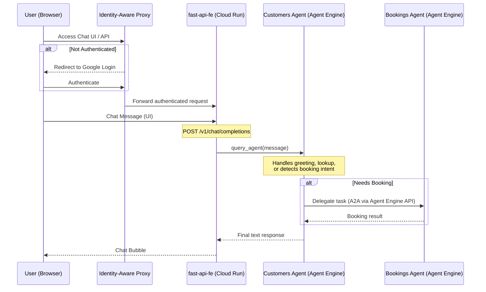

# fast-api-fe — Customer Booking Chatbot

A FastAPI web application that serves:

- **Chat UI** — modern dark-mode single-page UI at `GET /`
- **OpenAI-compatible API** — `POST /v1/chat/completions` that proxies to the `customers` ADK agent on Vertex AI Agent Engine

## Architecture



## Project Structure

```
fast-api-fe/
├── main.py                 # FastAPI app entry point
├── routers/
│   ├── chat.py             # POST /v1/chat/completions
│   └── ui.py               # GET / (renders chat.html)
├── services/
│   └── agent_client.py     # Vertex AI Agent Engine proxy
├── models/
│   └── openai_schema.py    # Pydantic OpenAI schema models
├── templates/
│   └── chat.html           # Jinja2 chat UI
├── static/
│   ├── style.css           # Dark glassmorphism styles
│   └── chat.js             # Fetch-based chat client
├── requirements.txt
├── Dockerfile
└── .dockerignore
```

## Prerequisites

- Python 3.12+
- A deployed `customers` agent on Vertex AI Agent Engine
- GCP credentials with `roles/aiplatform.user`

## Local Development

```bash
# 1. Install dependencies
cd fast-api-fe
pip install -r requirements.txt

# 2. Set environment variables
export PROJECT_ID=genai-apps-25
export LOCATION=us-central1
export CUSTOMERS_ENGINE_ID=projects/803095609412/locations/us-central1/reasoningEngines/376330944350519296

# 3. Run the server (from project root)
uvicorn fast-api-fe.main:app --reload --port 8080

# 4. Open http://localhost:8080
```

## API Usage

```bash
curl -X POST http://localhost:8080/v1/chat/completions \
  -H "Content-Type: application/json" \
  -d '{"messages": [{"role": "user", "content": "Show me all customers"}]}'
```

## Docker & Cloud Run

### 1. Build and Push via Cloud Build

Run this from the **project root** to build the image and push it to Artifact Registry:

```bash
# Substitutions are used for the image tag
gcloud builds submit --config .cloudbuild/build-fast-api-fe.yaml \
  --substitutions=COMMIT_SHA=$(git rev-parse HEAD) .
```

### 2. Deploy to Cloud Run

Deploy the `latest` image to Cloud Run with the required environment variables:

```bash
PROJECT_ID=genai-apps-25
REGION=us-central1
IMAGE="${REGION}-docker.pkg.dev/${PROJECT_ID}/adk/fast-api-fe:latest"
CUSTOMERS_ENGINE_ID="projects/genai-apps-25/locations/us-central1/reasoningEngines/4698379211742642176"

gcloud run deploy customer-chatbot \
  --image=$IMAGE \
  --region=$REGION \
  --port=8080 \
  --set-env-vars="PROJECT_ID=${PROJECT_ID},LOCATION=${REGION},CUSTOMERS_ENGINE_ID=${CUSTOMERS_ENGINE_ID}" \
  --memory=512Mi --cpu=1
```

> **Note on IAP**: For production, remove `--allow-unauthenticated` and attach a Global HTTPS Load Balancer with IAP enabled. See `plans/fast-api-fe.md` for full setup steps.
>
> If you encounter "Access Denied" errors when testing IAP, ensure your user has the **IAP-secured Web App User** role:
>
> ```bash
> gcloud projects add-iam-policy-binding genai-apps-25 \
>   --member="user:your-email@example.com" \
>   --role="roles/iap.httpsResourceAccessor"
> ```

## Environment Variables

| Variable              | Default         | Description                         |
| --------------------- | --------------- | ----------------------------------- |
| `PROJECT_ID`          | `genai-apps-25` | GCP project ID                      |
| `LOCATION`            | `us-central1`   | Vertex AI region                    |
| `CUSTOMERS_ENGINE_ID` | _(required)_    | Full Agent Engine resource name     |
| `PORT`                | `8080`          | Server port (injected by Cloud Run) |
