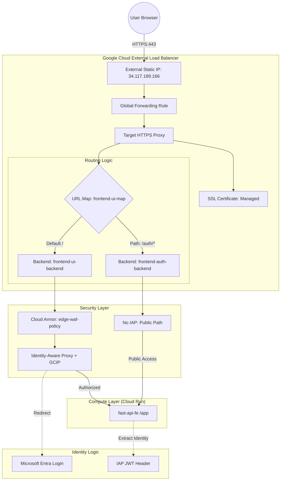

# Ingress & IAP Security Architecture

This document outlines the hardened perimeter security implemented for the Agent Security Patterns project. It details how traffic is routed, inspected, and authenticated before reaching the application.

## 🏗️ Architecture Overview

The system uses a **Global External Application Load Balancer** with integrated security services to create a defense-in-depth perimeter.

## 🔒 Security Components

### 1. Cloud Armor (WAF)
- **Policy Name:** `edge-waf-policy`
- **Protection:** Configured with preconfigured WAF rules to block:
    - **SQL Injection (SQLi):** `sqli-stable`
    - **Cross-Site Scripting (XSS):** `xss-stable`
- **Action:** Deny 403 for matching malicious patterns.

### 2. Identity-Aware Proxy (IAP) & GCIP
- **Backend Service:** `frontend-ui-backend`
- **Identity Provider:** Google Cloud Identity Platform (GCIP) with Microsoft Entra ID integration.
- **Tenant ID:** `ms-agent-tenant-tyd6t`
- **Mechanism:** Intercepts requests, redirects unauthenticated users to Microsoft Login, and vaults tokens via the "Before Sign-in" blocking function.

### 3. Serverless Ingress Control
- **Configuration:** Cloud Run service `frontend-ui` is set to `Ingress: Internal and Cloud Load Balancing`.
- **Identity:** Only the **IAP Service Agent** (`service-[PROJECT_NUMBER]@gcp-sa-iap.iam.gserviceaccount.com`) is granted `roles/run.invoker`. 
- **Benefit:** Direct access to the `.run.app` URL is blocked, forcing all traffic through the Load Balancer and its security layers.

## 🌐 Networking Details

| Resource | Value |
| :--- | :--- |
| **External IP** | `34.117.189.166` |
| **Custom Domain** | `bookings.yannipeng.demo.altostrat.com` |
| **SSL Certificate** | `frontend-ui-cert` (Google-managed) |
| **Load Balancer** | `frontend-ui-map` |
| **NEG** | `frontend-ui-neg` (Serverless) |

## 📜 Script Reference

The automation for this perimeter is split into modular scripts within the `ingress/` directory.

### Ingress & Load Balancing (`ingress/setup-scripts/`)

| Script | Purpose |
| :--- | :--- |
| `setup-external-ip-addr.sh` | Reserves a global static IPv4 address (`lb-ip-cr-ue-f`) for the Load Balancer. |
| `setup-ingress.sh` | **The Core Security Logic:**  1. Creates the **Cloud Armor** WAF policy. 2. Grants the **IAP Service Agent** exclusive rights to invoke Cloud Run. 3. Creates the **Serverless NEG** for Cloud Run. 4. Configures the **Protected Backend** (`frontend-ui-backend`) and applies IAP/GCIP settings. 5. Configures the **Public Auth Backend** (`frontend-auth-backend`). |
| `setup-forwarding-rules.sh` | **Networking Plumbing:**  1. Creates the **URL Map**. 2. Requests a **Google-managed SSL Certificate**. 3. Sets up the **Target HTTPS Proxy** and **Forwarding Rule** (Port 443). |
| `setup-url-map.sh` | **Path-Based Routing:** Updates the URL Map to ensure `/auth/*` traffic is routed to the unprotected backend, while all other traffic goes to the IAP-protected backend. |
| `setup-all.sh` | Orchestrator script that runs the Ingress, Forwarding Rules, and URL Map scripts in sequence. |

### Token Vaulting (`ingress/before-sign-in-handler/`)

| Script | Purpose |
| :--- | :--- |
| `deploy.sh` | Deploys the Node.js **Blocking Function** to Cloud Functions (Gen 2). This function contains the logic to intercept OAuth tokens and store them in Secret Manager. |
| `attach-function-to-iap.sh` | Connects the deployed Cloud Function to **Identity Platform**. It patches the project configuration so the function is triggered automatically during the `beforeSignIn` event. |

---
