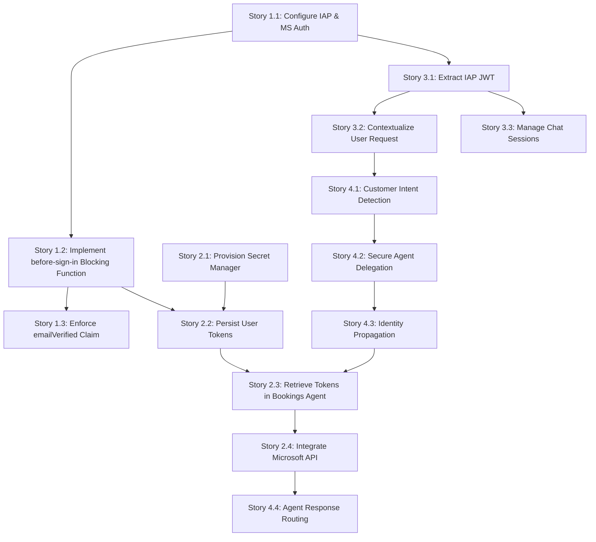

# Phase 1: Epics & Detailed User Stories

This document outlines the detailed user stories and interdependencies for the Phase 1 modernization effort, derived from the `future_state.md` architecture.

## Epic 1: Secure Authentication & Identity (IAP, MS Auth, Blocking Functions)
**Goal:** Establish a robust authentication perimeter using Google Cloud IAP and Microsoft Identity Provider, intercepting login events to manage tokens.
*   **Story 1.1: Configure IAP & MS Auth:** As an administrator, I want to configure Identity-Aware Proxy and Identity Platform to use Microsoft as an OIDC/SAML provider so that users can log in with their Microsoft credentials.
*   **Story 1.2: Implement `before-sign-in` Blocking Function:** As a backend system, I want a Cloud Run/Cloud Function to act as a `before-sign-in` trigger so that I can intercept the authentication flow upon a successful Microsoft login.
*   **Story 1.3: Enforce `emailVerified` Claim:** As a security module, I want the blocking function to set `emailVerified: true` (or equivalent custom claims) on the user's token so that subsequent systems can trust the authentication payload.

## Epic 2: Token Management & External Service Integration (Secret Manager, MS API)
**Goal:** Securely persist user tokens acquired during login and utilize them within the Bookings Agent to perform actions on behalf of the user.
*   **Story 2.1: Provision Secret Manager:** As an infrastructure engineer, I want to provision Google Cloud Secret Manager to securely store sensitive Oauth/Refresh tokens.
*   **Story 2.2: Persist User Tokens:** As the blocking function, I want to save the user's Microsoft Identity tokens directly into Secret Manager (keyed by user ID/`sub`) during the `before-sign-in` hook.
*   **Story 2.3: Retrieve Tokens in Bookings Agent:** As the Bookings Agent, I want to securely fetch the user's tokens from Secret Manager using the provided user ID (`sub`).
*   **Story 2.4: Integrate Microsoft API:** As the Bookings Agent, I want to use the retrieved Microsoft tokens to perform authenticated API actions (e.g., booking calendar events) on behalf of the user.

## Epic 3: Frontend Chat Experience (IAP JWT Extraction, Session Management)
**Goal:** Secure the FastAPI web interface and securely extract the user's identity to contextualize their chat sessions.
*   **Story 3.1: Extract IAP JWT:** As the FastAPI frontend, I want to intercept incoming requests and extract the `x-goog-iap-jwt-assertion` header to validate the user's identity.
*   **Story 3.2: Contextualize User Request:** As the FastAPI frontend, I want to parse the user's identity (`sub`, email) from the JWT and inject it into the session context payload before calling the Agent SDK.
*   **Story 3.3: Manage Chat Sessions:** As a user, I want my chat history to be securely managed and isolated based on my authenticated identity to prevent data leakage between users.

## Epic 4: Orchestration & Multi-Agent Communication (Customers -> Bookings Agent)
**Goal:** Establish an intelligent orchestrator that understands user intent and securely delegates complex booking operations to a specialized sub-agent.
*   **Story 4.1: Customer Intent Detection:** As the Customers Orchestrator Agent, I want to analyze the incoming user message to detect if the intent is to create, modify, or cancel a booking.
*   **Story 4.2: Secure Agent Delegation:** As the Customers Orchestrator Agent, I want to invoke the Bookings Agent via a defined Tool Execution path when booking intent is detected.
*   **Story 4.3: Identity Propagation:** As the Customers Orchestrator Agent, I want to pass the extracted user identity (`sub` from JWT) as a secure parameter to the Bookings Agent so it knows whose data to act upon.
*   **Story 4.4: Agent Response Routing:** As the Customers Orchestrator Agent, I want to receive the success/failure response from the Bookings Agent and translate it into a natural language reply for the user.

## Story Interdependencies (Mermaid Diagram)

