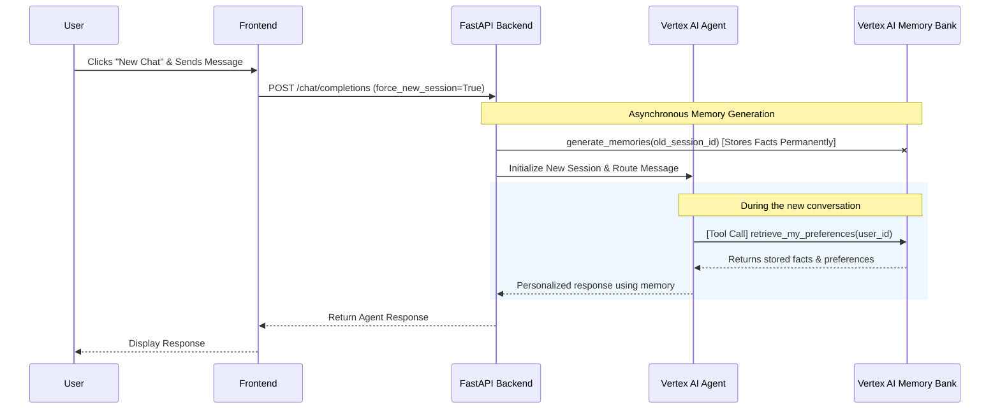

# Long-Term Memory Implementation Plan

## Overview
Implement long-term, cross-session memory for the Customer Booking Agent using **Vertex AI Agent Engine Memory Bank**. This allows the agent to automatically learn from user conversations (e.g., preferred travel destinations, seating preferences) and access those memories in future sessions, providing a highly personalized experience.

## User Flow

**Memory Generation (After Session)**: When a user clicks "New Chat", their current conversation officially ends. The backend instantly creates a fresh session for the user to chat in, but dispatches the finished session (`old_session_id`) to an asynchronous background task. This background task reads the finished conversation and **permanently stores** any useful extracted facts into the user's Memory Bank. Doing this in the background ensures the chat interface remains lag-free.

**Memory Retrieval (During Session):** While chatting, the Agent can proactively call the `retrieve_my_preferences` tool to fetch long-term context about the user from the Memory Bank, allowing it to personalize responses on the fly.



## Documentation References

### Google Developer Knowledge
> **Ref-1:** [Vertex AI Agent Engine Sessions](documents/docs.cloud.google.com/agent-builder/agent-engine/sessions/overview) — Sessions provide definitive sources for long-term memory and conversation context.
> **Ref-2:** [Vertex AI Memory Bank Overview](documents/docs.cloud.google.com/agent-builder/agent-engine/memory-bank/overview) — Memory Bank dynamically generates long-term memories from user conversations (SessionEvents). Memories are scoped to individual identities (`user_id`).
> **Ref-3:** [Vertex AI Memory Bank Quickstart](documents/docs.cloud.google.com/agent-builder/agent-engine/memory-bank/quickstart-api) — Shows how to trigger memory generation using `client.agent_engines.memories.generate()` with a session source.

## Current State
The Customer Booking Agent currently stores per-session chat history using Vertex AI Agent Engine Sessions (`client.agent_engines.sessions.events.list`), keyed by `session_id` and `user_id`. However, information is isolated within a single session. When a new session begins, the agent forgets personal preferences discussed previously.

## 📋 Checklist
- [ ] Add `fast-api-fe/services/agent_client.py` method to trigger memory generation (`generate_memories`) at the end of a session.
- [ ] Add `fast-api-fe/services/agent_client.py` method to retrieve user memories (`get_user_memories`).
- [ ] Create a new tool in `customers/agent.py` to allow the agent to fetch the user's long-term memory.
- [ ] Hook the memory generation step into the FastAPI app (e.g. as a background task when the user creates a "New Chat").

## Proposed Changes

### `fast-api-fe/services/agent_client.py`
We will add functions to interact with the Memory Bank via the Vertex AI SDK.

#### [NEW] `generate_memories(user_id: str, session_id: str)`
Automatically extract and consolidate facts from a completed session and save them to the user's Memory Bank scoped to their identity.

```python
def generate_memories(user_id: str, session_id: str) -> bool:
    try:
        client = vertexai.Client(project=PROJECT_ID, location=LOCATION)
        session_name = f"{ENGINE_ID}/sessions/{session_id}"
        
        # Trigger background memory generation from the session
        client.agent_engines.memories.generate(
            name=ENGINE_ID,
            vertex_session_source={"session": session_name},
            scope={"user_id": user_id}
        )
        return True
    except Exception as e:
        logger.error(f"Failed to generate memories for session {session_id}: {e}")
        return False
```

### `customers/agent.py`
Instead of heavily modifying the agent's system prompt (which increases token usage on every turn), we can provide a new Tool that lets the agent proactively fetch user background information from the Memory Bank when it deems necessary.

```python
def retrieve_my_preferences(tool_context: ToolContext) -> str:
    """Retrieve long-term memories, travel preferences, and background info for the current user."""
    user_id = tool_context.user_id
    
    # Ideally, call the agent_client.get_user_memories(user_id) or equivalent.
    # Return formatted facts to the agent.
    ...
```
*(Add this tool to `root_agent.tools`)*

### `fast-api-fe/routers/chat.py`
To ensure memories are generated without blocking the user interface, we can dispatch `generate_memories` to FastAPI's `BackgroundTasks` whenever a session is explicitly "closed" or when the user begins a new chat.

## Trade-offs & Considerations
- **Memory Bank vs. RAG Corpus**: We chose **Memory Bank** because it is purpose-built for dynamic, evolving facts gathered from user interactions. A RAG Corpus is better suited for static organizational knowledge (like policy PDFs or large databases). Memory Bank automatically extracts and consolidates facts over time.
- **Latency**: Generating memories via an LLM takes time. We must execute it asynchronously in the background (`fastapi.BackgroundTasks`) rather than blocking a chat response.
- **Privacy/Security**: Memories are keyed by `user_id` scope, ensuring strict multi-tenant isolation so one user's data isn't leaked to another.

## Next Steps
1. User approves this plan.
2. Implement backend memory generation (`generate_memories`) and memory retrieval in the API service.
3. Create the `retrieve_my_preferences` tool in the Agent so it can access the Memory Bank.
4. Hook the generation into the `/v1/chat/completions` API when a session boundary is crossed (e.g. `force_new_session=True`).
5. Run integration tests to ensure cross-session facts are remembered.
