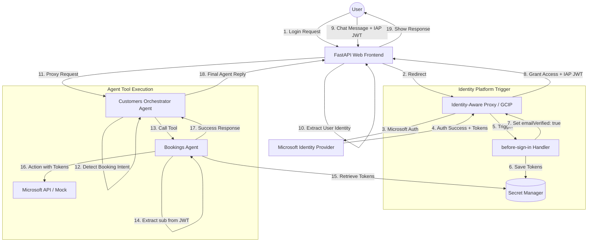

```mermaid
graph TD
    %% Authentication Phase
    User((User)) -->|1. Login Request| WebApp[FastAPI Web Frontend]
    WebApp -->|2. Redirect| IAP[Identity-Aware Proxy / GCIP]
    IAP -->|3. Microsoft Auth| MS[Microsoft Identity Provider]
    MS -->|4. Auth Success + Tokens| IAP
    
    subgraph BlockingFunction [Identity Platform Trigger]
        IAP -->|5. Trigger| BSI[before-sign-in Handler]
        BSI -->|6. Save Tokens| SM[(Secret Manager)]
        BSI -->|7. Set emailVerified: true| IAP
    end
    
    IAP -->|8. Grant Access + IAP JWT| WebApp
    
    %% Chat Phase
    User -->|9. Chat Message + IAP JWT| WebApp
    WebApp -->|10. Extract User Identity| WebApp
    WebApp -->|11. Proxy Request| CA[Customers Orchestrator Agent]
    CA -->|12. Detect Booking Intent| CA
    
    subgraph AgentAction [Agent Tool Execution]
        CA -->|13. Call Tool| BA[Bookings Agent]
        BA -->|14. Extract sub from JWT| BA
        BA -->|15. Retrieve Tokens| SM
        BA -->|16. Action with Tokens| MSApi[Microsoft API / Mock]
    end
    
    BA -->|17. Success Response| CA
    CA -->|18. Final Agent Reply| WebApp
    WebApp -->|19. Show Response| User
```